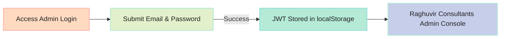

# Raghuvir Consultants Admin Console User Guide (v2.12.27)

Complete operational manual for managing the Raghuvir Consultants advisory platform via `https://admin.raghuvirconsultants.in` (or `/adminDashboard`).

---

## 1. Authentication & Access
- **URL**: `https://admin.raghuvirconsultants.in/login`
- **Default Admin Username / Email**: `admin` / `admin@raghuvir.com`
- **Default Admin Password**: `Raghuvir#Admin2026!`

---

## 2. Navigating Categorized Admin Sections

The left sidebar is organized into 5 distinct operational categories under **Raghuvir Consultants Admin**:

### Category 1: Dashboard
- **Home Overview**: View active investor metrics, research publications count, model portfolio stock count, and blog post stats.

### Category 2: Investors
- **Investor Directory**:
  - **Facebook-Style Investor Profile Page**: Rich hero cover banner, circular avatar with active/suspended indicator, SEBI verified checkmark, 2-column Facebook feed layout, tabbed navigation (Overview & Timeline, About & KYC Compliance, Contact & Residential Address, Subscriptions & Portfolios, Security & Account Audit), and internal admin note posting.
  - Full Indian KYC Compliance fields (PAN number, Gender, Date of Birth, Full Address, Referral Source).
  - Dedicated Sub-Page Editor (`/investors/new` & `/investors/edit/:id`) with interactive breadcrumbs.
  - Account status options: **Activate**, **Disable**, or **Blacklist**.

### Category 3: Site Static Content
- **Blog Posts**: Markdown blog publisher with tag management.
- **Services Offered**: Monthly pricing tier configuration.
- **Smallcases**: Quantitative strategy theme offerings.

### Category 4: Premium Subscription
- **Research Reports**:
  - Add **Google Doc / External Report Link** (`doc_link`) in the creation form.
  - Multi-selection checkboxes + Mass Status Change (`Published`, `Draft`, `Archived`) + Mass Delete.
  - Click table headers to sort ascending/descending.
  - Direct Page-Numbered Pagination with Jump to Page input (`[1] [2] [3] ... [20]`).
- **Model Portfolio**:
  - Add/Edit stock holdings (Ticker, Entry Price, Target Price, Stop Loss, Weightage %).
  - Multi-selection checkboxes + Mass Delete.
  - Column sorting and transaction type filter (`BUY`/`SELL`).

### Category 5: Misc
- **News Feed**: Publish market updates.
- **Alerts**:
  - Quick inline status dropdown selector (`Published`, `Draft`, `Archived`) on each row.
  - Multi-selection checkboxes + Mass Bulk Action Bar.
- **System Status**: View real-time API version, MongoDB ping speed in `ms`, and CPU/Memory gauges.
