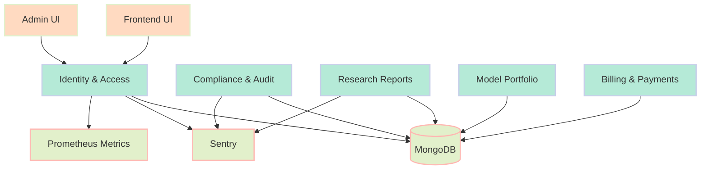
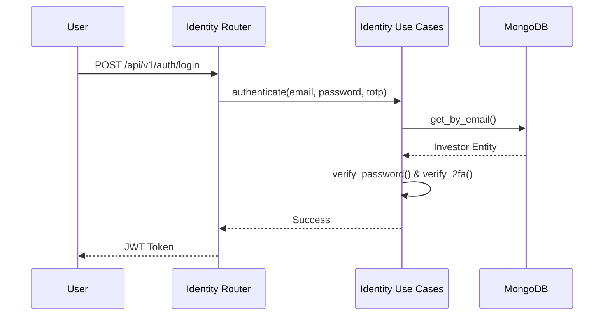

# Architecture & System Design

## Bounded Contexts
The backend follows Domain-Driven Design principles with clean architecture.

## Security & Identity
We use JWT for authorization and TOTP for multi-factor authentication.

