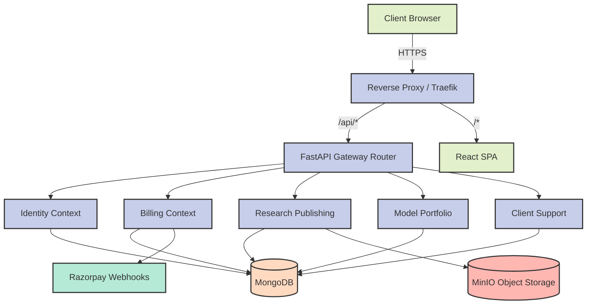
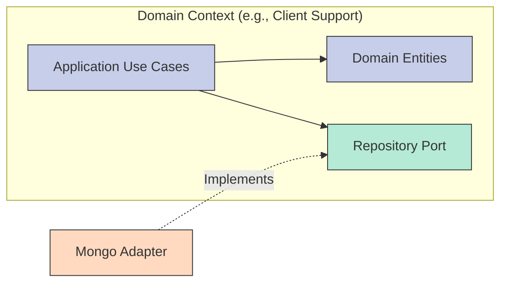

# System Architecture & API Specifications

## System Overview
Raghuvir Consultants uses a modular monolith architectural style with Domain-Driven Design (DDD) bounded contexts. The system consists of a FastAPI backend connecting to MongoDB and MinIO, and a React frontend serving two distinct experiences (Marketing Site and Investor/Admin Portal).

## High-Level Architecture Diagram

## Bounded Context Boundaries
Each context is entirely self-contained.

## Admin Console: Operational Guide

### 1. Research Publishing
- **Goal:** Publish secure, watermarked PDFs to institutional investors.
- **Workflow:** Go to `Research Reports` -> Click `Publish Report`. Upload the PDF file and set the abstract.
- **Behind the scenes:** The PDF is uploaded to MinIO WORM storage. It cannot be deleted or modified. When an investor downloads it, the `PDFWatermarker` stamps their ID on every page.

### 2. Model Portfolios
- **Goal:** Distribute real-time asset allocation data.
- **Workflow:** Go to `Model Portfolios`. You can create smallcases or generic portfolios. Add assets (tickers, allocation percentages, entry prices). 
- **Behind the scenes:** Real-time updates trigger webhooks or notifications to active subscribers.

### 3. Client Support
- **Goal:** Answer investor inquiries.
- **Workflow:** Go to `Support Inbox`. Select an open ticket. You will see a chat interface. Type your reply and click send. Close the ticket when resolved.
- **Behind the scenes:** Ticket messages are stored in MongoDB as an array on the Ticket document.

### 4. Billing & Subscriptions
- **Goal:** Track active subscriptions.
- **Workflow:** Go to `Billing Dashboard` to see Razorpay webhook events and subscription statuses.
- **Behind the scenes:** The system listens for Razorpay webhook events to activate or expire subscriptions automatically. No manual intervention is needed.

## API Specifications
The application mounts individual context routers onto the main Gateway router (`main.py`). The full Swagger API documentation is automatically generated by FastAPI and is available at `/docs` when running the backend.
