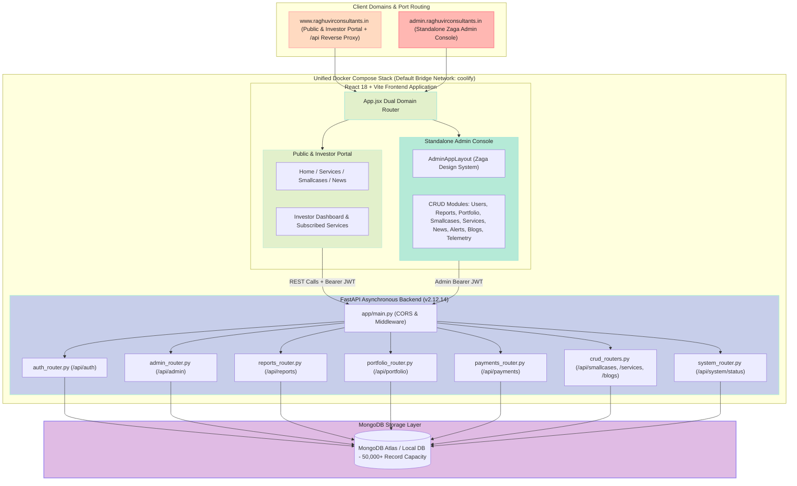
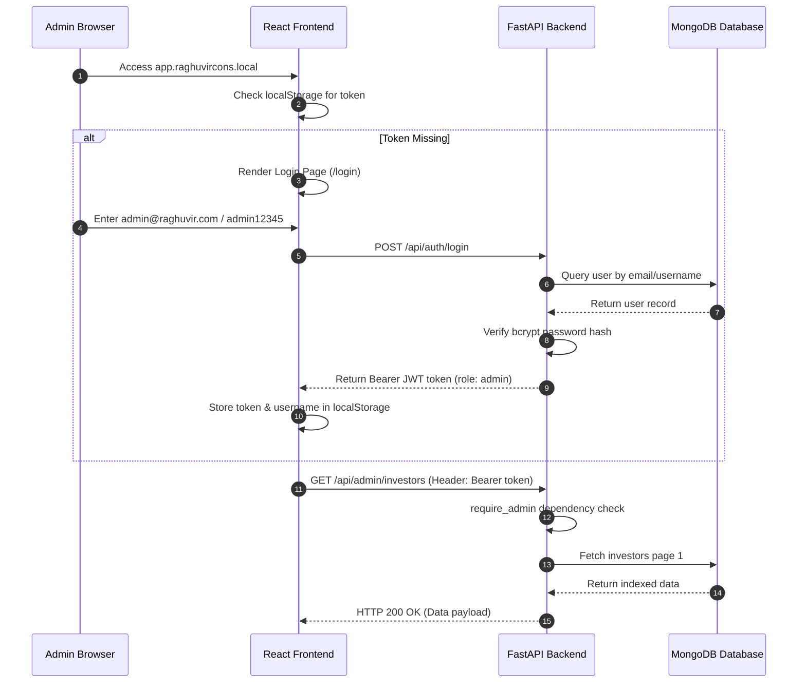

# Enterprise System Architecture (v2.12.14)

This document provides complete technical specifications for the Raghuvir Consultants Enterprise Wealth & Advisory platform.

---

## 1. System Overview & Domain Topology

The platform operates on a decoupled client-server architecture serving unified and admin domain contexts managed via **Docker Compose**:
- **`raghuvircons.local` / `www.raghuvirconsultants.in` (Port 80/443)**: Main Public Portal, Investor Dashboard, & `/api/` reverse-proxied FastAPI backend.
- **`app.raghuvircons.local` / `admin.raghuvirconsultants.in` (Port 80/443)**: Zaga Admin Console context.
- **FastAPI REST API Server (Port 8000)**: Asynchronous Python backend powered by MongoDB Atlas / Local MongoDB.

---

## 2. Authentication & Authorization Lifecycle

---

## 3. High Performance & Scalability Design

1. **50,000+ Record Database Indexing**:
   - Compound MongoDB indexes on `email`, `created_at`, `tags`, `status`, and `published_at`.
   - Server-side skip/limit pagination enforced across all endpoints (`page=1&limit=10`).
2. **Security Hardening**:
   - bcrypt password hashing with policy enforcement (min 7 chars + special char `!@#$%`).
   - Role-based authorization (`UserRole.ADMIN` vs `UserRole.INVESTOR`).
