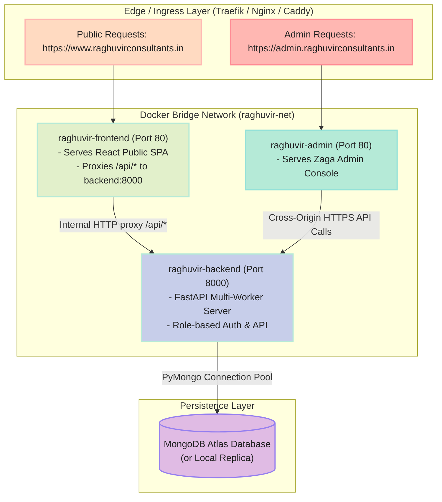

# Docker Compose Production Deployment & Operations Guide

This guide provides complete, step-by-step operational instructions for deploying and running the unified multi-service Raghuvir Consultants stack using **Docker Compose** on **Coolify**, **Generic Linux VPS**, or **Local Development**.

---

## 1. Stack Topology & Architecture



---

## 2. Deploying on Coolify (Recommended)

### Step 1: Add a Docker Compose Resource
1. Log in to your Coolify Dashboard.
2. Navigate to **Projects** ➔ Select your Project & Environment.
3. Click **+ New Resource** ➔ Select **Docker Compose**.
4. Choose **Git Repository** (Connect `tejasrsuthar/raghuvirconsultants-site` or your repository).
5. Set Branch to `main` (or your deployment branch).
6. Coolify will automatically detect the root `docker-compose.yml`.

### Step 2: Configure Environment Variables in Coolify
In the Docker Compose application settings under **Environment Variables**, add the following keys:

```env
MONGO_URI=mongodb+srv://<dbuser>:<dbpass>@cluster0.mongodb.net/raghuvir_db?retryWrites=true&w=majority
SECRET_KEY=generate_a_secure_64_character_random_string_here
ALLOWED_ORIGINS=https://www.raghuvirconsultants.in,https://raghuvirconsultants.in,https://admin.raghuvirconsultants.in
VITE_GOOGLE_CLIENT_ID=your-google-client-id.apps.googleusercontent.com
```

### Step 3: Deploy the Stack
1. Click **Deploy**.
2. Coolify will:
   - Build the `backend`, `frontend`, and `admin-dashboard` Docker images in parallel.
   - Provision the internal `raghuvir-net` bridge network.
   - Configure Traefik routing with automatic Let's Encrypt SSL certificates for:
     - `https://www.raghuvirconsultants.in` & `https://raghuvirconsultants.in` ➔ `frontend`
     - `https://admin.raghuvirconsultants.in` ➔ `admin-dashboard`
   - Wait for the health checks to pass before routing traffic.

### Step 4: Decommission Old Standalone Applications
Once the new Docker Compose resource is healthy and operational:
1. Navigate back to your Coolify project.
2. Stop and delete the 3 old standalone application resources (`main-site-and-investor-portal`, `admin-dashboard`, `backend-api`) to free system resources.

---

## 3. Deploying on Generic Linux VPS (Ubuntu / Debian / EC2 / DigitalOcean / Hetzner)

If migrating to a raw cloud server without Coolify:

### Step 1: Install Docker & Docker Compose
```bash
sudo apt-get update && sudo apt-get install -y docker.io docker-compose-plugin
sudo systemctl enable --now docker
```

### Step 2: Clone the Repository & Configure `.env`
```bash
git clone https://github.com/tejasrsuthar/raghuvirconsultants-site.git
cd raghuvirconsultants-site

cp .env.example .env
nano .env  # Enter your MONGO_URI, SECRET_KEY, etc.
```

### Step 3: Start the Stack
```bash
# Build and start all services in the background
docker compose up -d --build
```

### Step 4: Reverse Proxy Setup (Caddy Example)
If using Caddy on the host machine to handle automatic HTTPS:
```caddy
www.raghuvirconsultants.in, raghuvirconsultants.in {
    reverse_proxy localhost:80
}

admin.raghuvirconsultants.in {
    reverse_proxy localhost:80
}
```

---

## 4. Useful Operations & Maintenance Commands

### Check Running Containers
```bash
docker compose ps
```

### View Live Logs
```bash
# Tail logs across all services
docker compose logs -f

# Tail logs for a specific service
docker compose logs -f backend
docker compose logs -f frontend
docker compose logs -f admin-dashboard
```

### Restart a Specific Service
```bash
docker compose restart backend
```

### Rebuild and Update After Code Changes
```bash
git pull origin main
docker compose up -d --build
```

### Inspect Internal Network Connectivity
```bash
docker compose exec frontend ping backend
docker compose exec frontend wget -qO- http://backend:8000/health
```

---

## 5. Security & Best Practices

1. **Keep Backend Isolated**:
   - The backend service only exposes port `8000` to the internal `raghuvir-net` Docker network. It is not mapped to host ports directly unless configured.
2. **Healthchecks**:
   - All services define automated healthcheck intervals (`/health`) with restart policies (`unless-stopped`) to ensure maximum uptime.
3. **Graceful Upgrades**:
   - Docker Compose handles rolling container upgrades with minimal disruption.
